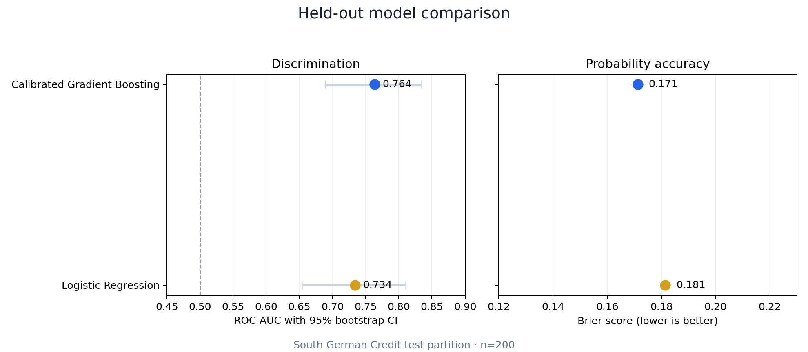
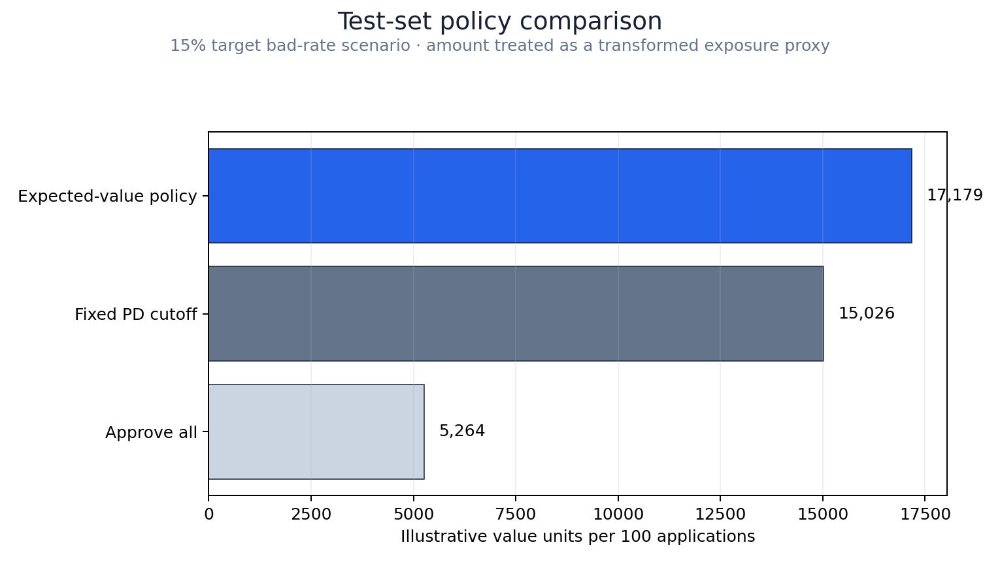
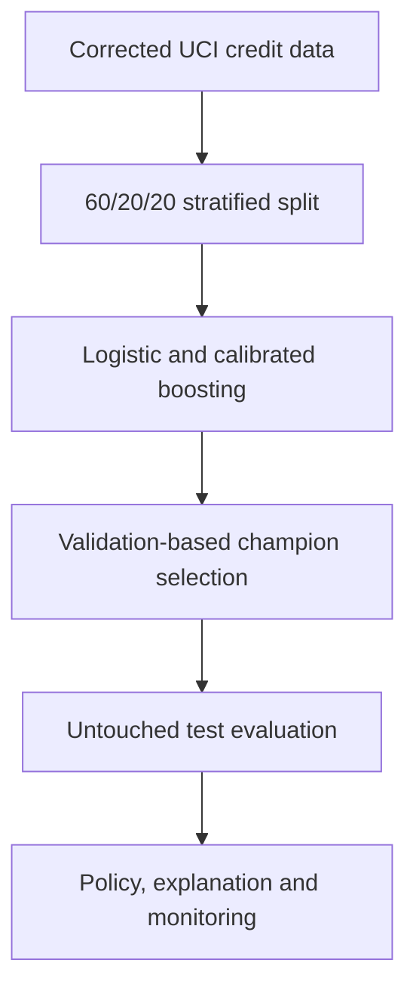
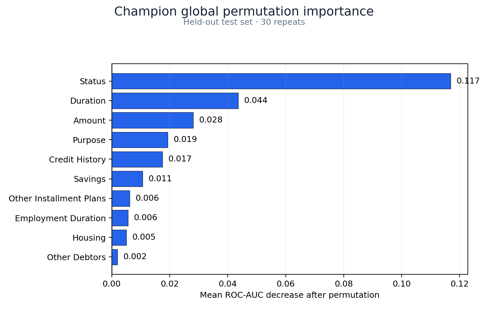
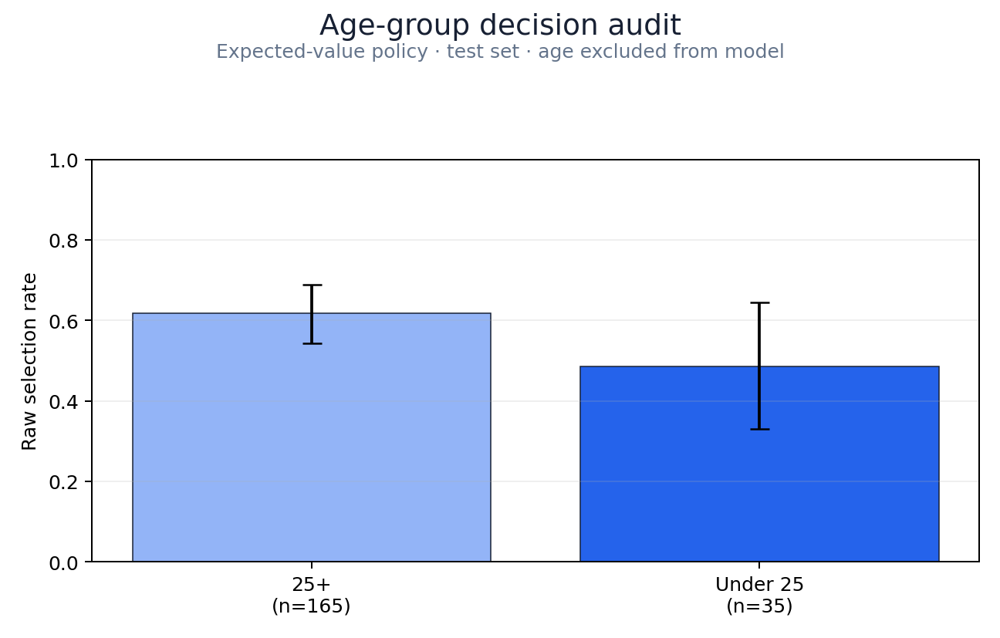

# Beyond the Score: Credit Decisioning with Machine Learning

[](https://github.com/dev-lorenzosartori/beyond-the-score-credit-decisioning/actions/workflows/ci.yml)


An end-to-end retail credit case that separates three questions often collapsed into one score:

1. **Risk:** what is the probability of bad credit?
2. **Policy:** should this application be approved under the current economics and risk appetite?
3. **Value:** what portfolio outcome does that policy create, with what uncertainty and governance constraints?

> **Decision principle:** the model estimates risk; policy turns risk into action; the business measures expected value.

Related article: **“Além do Score: Otimizando a Concessão de Crédito no Varejo com Machine Learning, Explicabilidade e Monitoramento Contínuo” — [publication pending](docs/ARTICLE.md).**

## Executive result

The calibrated gradient-boosting model was selected on **validation expected value**, not test AUC. On the untouched 200-contract test partition it improved both discrimination and probability accuracy over logistic regression.

| Model | ROC-AUC (95% bootstrap CI) | Gini | KS | Brier score |
|---|---:|---:|---:|---:|
| Logistic Regression | 0.734 [0.654, 0.810] | 0.468 | 0.355 | 0.181 |
| **Calibrated Gradient Boosting** | **0.764 [0.689, 0.834]** | **0.527** | **0.386** | **0.171** |



The business layer changes the conclusion from “which model ranks better?” to “which applications create positive expected contribution?” Under the documented 15% target bad-rate scenario:

| Champion test policy | Approval rate | Expected bad rate among approvals | Illustrative value per 100 applications |
|---|---:|---:|---:|
| Approve all | 100.0% | 15.0% | 5,264 |
| Fixed 15% PD cutoff | 56.2% | 7.1% | 15,026 |
| **Expected-value policy** | **64.8%** | **8.1%** | **17,179** |

The expected-value policy produces **226% more illustrative value** than approving all in this scenario, with a wide 95% bootstrap interval of **[8,127, 25,507]**. These are value units, not a monetary forecast: the historical `amount` field is a transformed exposure proxy and all economics are assumptions.



## From probability to decision

The public dataset intentionally oversamples bad credits to 30%. Before applying a policy, calibrated sample odds are shifted to a transparent operating scenario with a 15% bad rate:

$$
\operatorname{odds}(p_{target})
=\operatorname{odds}(p_{sample})
\times
\frac{0.15/(1-0.15)}{0.30/(1-0.30)}
$$

For application $i$, the decision layer evaluates:

$$
EV_i=(1-p_i)mA_i-p_i\,LGD\,A_i-C_{op}
$$

where the reproducible scenario uses margin $m=18\%$, $LGD=65\%$, and operating cost $C_{op}=50$ value units. Approve when $EV_i>0$. Every assumption is centralized in [`src/config.py`](src/config.py) and designed to be replaced by real finance inputs.

## Analytical workflow



The source has no application date, so an out-of-time split is impossible. The random split is a benchmark compromise and is stated as such. Test results never determine the champion.

## Explainability and decision governance

Global explanation uses held-out permutation importance on the original business fields. `status`, `duration`, and `amount` are the strongest model dependencies. Local reason codes replace one field at a time with its training reference and measure the score change; they are diagnostic and **not causal adverse-action reasons**.



Three sensitive or problematic fields are programmatically excluded from model inputs:

- `age` — retained for outcome auditing only;
- `foreign_worker` — retained for auditing, but the test subgroup has only six rows;
- `personal_status_sex` — combines sex and marital status, and the UCI documentation states that sex cannot be recovered reliably.

The raw test selection rate was 48.6% for applicants under 25 and 61.8% for applicants aged 25+, a **−13.2 percentage-point diagnostic gap**. The under-25 test group has only 35 records and overlapping uncertainty; the result triggers investigation, not a discrimination conclusion. Excluding a field does not guarantee fair outcomes.



## Monitoring design

The monitoring layer covers data contracts, missingness, feature PSI, score PSI, approval rate, expected risk, delayed realized bad rate, Brier score, discrimination, and subgroup outcomes. The included drift batch is deliberately synthetic: it proves that alerts fire without pretending that historical benchmark data represent production.

| PSI range | Status | Default response |
|---:|---|---|
| `< 0.10` | stable | continue monitoring |
| `0.10–0.25` | watch | segment and investigate |
| `≥ 0.25` | action | assess pipeline, calibration, policy, and retraining |

The demonstration identifies action-level drift in duration, amount, and the score distribution. See [`docs/MONITORING_PLAN.md`](docs/MONITORING_PLAN.md) and [`reports/monitoring_demo.csv`](reports/monitoring_demo.csv).

## Repository map

| Path | Purpose |
|---|---|
| `src/data.py` | Source validation, data contract, and deterministic split |
| `src/train_evaluate.py` | Leakage-safe training, selection, test evaluation, and figures |
| `src/metrics.py` | AUC/Gini/KS, calibration, bootstrap, and prior correction |
| `src/policy.py` | Expected-value decisions and prevalence-weighted policy comparison |
| `src/explainability.py` | Global permutation importance and local diagnostic reason codes |
| `src/fairness.py` | Group outcome metrics, Wilson intervals, and sample-size warnings |
| `src/monitoring.py` | Numeric/categorical PSI and deterministic drift demonstration |
| `sql/` | Leakage-safe feature-mart and delayed-outcome monitoring examples |
| `notebooks/` | Executed reader-facing analysis companion |
| `tests/` | Data, metric, policy, monitoring, fairness, and model checks |
| `reports/` | Machine-readable evidence and publication-ready figures |

## Reproduce

Python 3.12 is used in GitHub Actions.

```bash
python -m venv .venv
source .venv/bin/activate
python -m pip install -r requirements.txt

make test
make evaluate
make notebook
```

The source dataset is included under CC BY 4.0 with attribution and a locked SHA-256 checksum. Generated model binaries are excluded and recreated with `make evaluate`.

## Evidence boundary

South German Credit contains 1,000 accepted contracts from a southern German bank in 1973–1975. It is a stratified, accepted-only sample: bad credits were heavily oversampled, declined applicants are absent, exposure amounts are transformed, and no timestamps exist. It cannot validate contemporary default rates, monetary returns, reject inference, current regulation, causal fairness, or temporal stability.

This repository is a modeling and governance portfolio case. It must not be used for real consumer credit decisions.

## Sources

- [UCI South German Credit dataset](https://archive.ics.uci.edu/dataset/522/south+german+credit), DOI [10.24432/C5X89F](https://doi.org/10.24432/C5X89F)
- [Grömping (2019), *South German Credit Data: Correcting a Widely Used Data Set*](https://www1.beuth-hochschule.de/FB_II/reports/Report-2019-004.pdf)
- [scikit-learn probability calibration documentation](https://scikit-learn.org/stable/modules/calibration.html)

## About

Built by [Lorenzo Sartori](https://github.com/dev-lorenzosartori) as a portfolio case in credit risk, machine learning, decision science, explainability, and model monitoring.

Explore the broader portfolio: [Lorenzo Data Portfolio](https://lorenzo-data-portfolio.lorenzosartori34.chatgpt.site)
